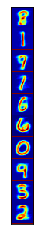

#Thuật toán phân cụm Kmean

Chúng ta sẽ làm một ví dụ đơn giản. Trước hết, ta tạo tâm cụm và dữ liệu cho
từng cụm bằng cách lấy mẫu theo phân phối chuẩn có kỳ vọng là tâm của cụm
đó và ma trận hiệp phương sai là ma trận đơn vị. Ở đây, hàm cdist trong scipy.
spatial.distance được dùng để tính khoảng cách giữa các cặp điểm trong hai tập
hợp một cách hiệu quả
Dữ liệu được tạo bằng cách lấy ngẫu nhiên 500 điểm cho mỗi cụm theo phân phối
chuẩn có kỳ vọng lần lượt là (2, 2), (8, 3) và (3, 6); ma trận hiệp phương sai
giống nhau và là ma trận đơn vị.
```python
from __future__ import print_function
import numpy as np
import matplotlib.pyplot as plt
from scipy.spatial.distance import cdist
import random
np.random.seed(18)
means = [[2, 2], [8, 3], [3, 6]]
cov = [[1, 0], [0, 1]]
N = 500
X0 = np.random.multivariate_normal(means[0], cov, N)
X1 = np.random.multivariate_normal(means[1], cov, N)
X2 = np.random.multivariate_normal(means[2], cov, N)
X = np.concatenate((X0, X1, X2), axis = 0)
K = 3 # 3 clusters
original_label = np.asarray([0]*N + [1]*N + [2]*N).T

def kmeans_init_centroids(X, k):
    # randomly pick k rows of X as initial centroids
    #Khoi tao cac phan cum
    return X[np.random.choice(X.shape[0], k, replace=False)]

def kmeans_assign_labels(X, centroids):
    #Tim nhan moi cho cac diem khi biet tam cum
    # calculate pairwise distances btw data and centroids
    D = cdist(X, centroids)
    # return index of the closest centroid
    return np.argmin(D, axis = 1)

def has_converged(centroids, new_centroids):
    #Cap nhap cac tam cum khi biet nhan tung diem
    # return True if two sets of centroids are the same
    return (set([tuple(a) for a in centroids]) ==
    set([tuple(a) for a in new_centroids]))

def kmeans_update_centroids(X, labels, K):
    #Kiem tra dieu kien dung cua thuat toan
    centroids = np.zeros((K, X.shape[1]))
    for k in range(K):
        # collect all points that are assigned to the k-th cluster
        Xk = X[labels == k, :]
        centroids[k,:] = np.mean(Xk, axis = 0) # take average
    return centroids
def kmeans(X, K):
    #Phan tich chinh cua phan cum Kmean
    centroids = [kmeans_init_centroids(X, K)]
    labels = []
    it = 0
    while True:
        labels.append(kmeans_assign_labels(X, centroids[-1]))
        new_centroids = kmeans_update_centroids(X, labels[-1], K)
        if has_converged(centroids[-1], new_centroids):
            break
        centroids.append(new_centroids)
        it += 1
    return (centroids, labels, it)

#Ap dung thuat toan vao du lieu ban dau va hien thi ket qua cuoi cung
centroids, labels, it = kmeans(X, K)
print('Centers found by our algorithm:\n', centroids[-1])
#kmeans_display(X, labels[-1])
```

    Centers found by our algorithm:
     [[3.02702878 5.95686115]
     [8.07476866 3.01494931]
     [1.9834967  1.96588127]]
    

Để kiểm tra thêm, chúng ta hãy so sánh kết quả trên với kết quả thu được bằng
cách sử dụng thư viện scikit−learn.
```python
#Thuat toan kmean viet bang thu vien Scikit-lean
from sklearn.cluster import KMeans
model = KMeans(n_clusters=3, random_state=0).fit(X)
print('Centers found by scikit-learn:')
print(model.cluster_centers_)
pred_label = model.predict(X)

```

    Centers found by scikit-learn:
    [[1.98417154 1.96141961]
     [8.07476866 3.01494931]
     [3.02429957 5.95334038]]
    
#Bai toán phân cụm chữ số viết tay
MNIST [LCB10] là bộ cơ sở dữ liệu lớn nhất về chữ số viết tay và được sử dụng
trong hầu hết các thuật toán phân loại hình ảnh. MNIST bao gồm hai tập con:
tập huấn luyện có 60 nghìn mẫu và tập kiểm tra có 10 nghìn mẫu. Tất cả đều đã
được gán nhãn.Mỗi bức ảnh là một ảnh xám (chỉ có một kênh), có kích thước 28 × 28 điểm ảnh
(tức 784 điểm ảnh). Mỗi điểm ảnh mang giá trị là một số tự nhiên từ 0 đến 255.
Các điểm ảnh màu đen có giá trị bằng không, các điểm ảnh càng trắng thì có giá
trị càng cao
```python
#%reset
import numpy as np 
from mnist import MNIST
import matplotlib.pyplot as plt
from sklearn.cluster import KMeans
from sklearn.neighbors import NearestNeighbors
from sklearn.preprocessing import normalize
```


```python
from display_network import *
from os.path import expanduser

mndata = MNIST('/Users/Nguyen Dinh Tiem/anaconda3/Lib/site-packages/mnist') # path to your MNIST folder 
mndata.load_testing()
mndata.load_testing()
X = mndata.test_images
X0 = np.asarray(X)[:1000,:]/256.0
X = X0

K = 10
kmeans = KMeans(n_clusters=K).fit(X)

pred_label = kmeans.predict(X)
```


```python

print(type(kmeans.cluster_centers_.T))
print(kmeans.cluster_centers_.T.shape)
A = display_network(kmeans.cluster_centers_.T, K, 1)

f1 = plt.imshow(A, interpolation='nearest', cmap = "jet")
f1.axes.get_xaxis().set_visible(False)
f1.axes.get_yaxis().set_visible(False)
plt.show()
# plt.savefig('a1.png', bbox_inches='tight')


# a colormap and a normalization instance
cmap = plt.cm.jet
norm = plt.Normalize(vmin=A.min(), vmax=A.max())

# map the normalized data to colors
# image is now RGBA (512x512x4) 
image = cmap(norm(A))

#import scipy.misc
#scipy.misc.imsave('aa.png', image)
```

    <class 'numpy.ndarray'>
    (784, 10)
    





```python
print(type(pred_label))
print(pred_label.shape)
print(type(X0))

```

    <class 'numpy.ndarray'>
    (1000,)
    <class 'numpy.ndarray'>
    


```python
N0 = 20;
X1 = np.zeros((N0*K, 784))
X2 = np.zeros((N0*K, 784))

for k in range(K):
    Xk = X0[pred_label == k, :]

    center_k = [kmeans.cluster_centers_[k]]
    neigh = NearestNeighbors(N0).fit(Xk)
    dist, nearest_id  = neigh.kneighbors(center_k, N0)
    
    X1[N0*k: N0*k + N0,:] = Xk[nearest_id, :]
    X2[N0*k: N0*k + N0,:] = Xk[:N0, :]
```

    C:\Users\Nguyen Dinh Tiem\anaconda3\lib\site-packages\sklearn\utils\validation.py:68: FutureWarning: Pass n_neighbors=20 as keyword args. From version 0.25 passing these as positional arguments will result in an error
      warnings.warn("Pass {} as keyword args. From version 0.25 "
    C:\Users\Nguyen Dinh Tiem\anaconda3\lib\site-packages\sklearn\utils\validation.py:68: FutureWarning: Pass n_neighbors=20 as keyword args. From version 0.25 passing these as positional arguments will result in an error
      warnings.warn("Pass {} as keyword args. From version 0.25 "
    C:\Users\Nguyen Dinh Tiem\anaconda3\lib\site-packages\sklearn\utils\validation.py:68: FutureWarning: Pass n_neighbors=20 as keyword args. From version 0.25 passing these as positional arguments will result in an error
      warnings.warn("Pass {} as keyword args. From version 0.25 "
    C:\Users\Nguyen Dinh Tiem\anaconda3\lib\site-packages\sklearn\utils\validation.py:68: FutureWarning: Pass n_neighbors=20 as keyword args. From version 0.25 passing these as positional arguments will result in an error
      warnings.warn("Pass {} as keyword args. From version 0.25 "
    C:\Users\Nguyen Dinh Tiem\anaconda3\lib\site-packages\sklearn\utils\validation.py:68: FutureWarning: Pass n_neighbors=20 as keyword args. From version 0.25 passing these as positional arguments will result in an error
      warnings.warn("Pass {} as keyword args. From version 0.25 "
    C:\Users\Nguyen Dinh Tiem\anaconda3\lib\site-packages\sklearn\utils\validation.py:68: FutureWarning: Pass n_neighbors=20 as keyword args. From version 0.25 passing these as positional arguments will result in an error
      warnings.warn("Pass {} as keyword args. From version 0.25 "
    C:\Users\Nguyen Dinh Tiem\anaconda3\lib\site-packages\sklearn\utils\validation.py:68: FutureWarning: Pass n_neighbors=20 as keyword args. From version 0.25 passing these as positional arguments will result in an error
      warnings.warn("Pass {} as keyword args. From version 0.25 "
    C:\Users\Nguyen Dinh Tiem\anaconda3\lib\site-packages\sklearn\utils\validation.py:68: FutureWarning: Pass n_neighbors=20 as keyword args. From version 0.25 passing these as positional arguments will result in an error
      warnings.warn("Pass {} as keyword args. From version 0.25 "
    C:\Users\Nguyen Dinh Tiem\anaconda3\lib\site-packages\sklearn\utils\validation.py:68: FutureWarning: Pass n_neighbors=20 as keyword args. From version 0.25 passing these as positional arguments will result in an error
      warnings.warn("Pass {} as keyword args. From version 0.25 "
    C:\Users\Nguyen Dinh Tiem\anaconda3\lib\site-packages\sklearn\utils\validation.py:68: FutureWarning: Pass n_neighbors=20 as keyword args. From version 0.25 passing these as positional arguments will result in an error
      warnings.warn("Pass {} as keyword args. From version 0.25 "
    


```python

plt.axis('off')
A = display_network(X2.T, K, N0)
f2 = plt.imshow(A, interpolation='nearest' )
plt.gray()
plt.show()

# import scipy.misc
# scipy.misc.imsave('bb.png', A)


# plt.axis('off')
# A = display_network(X1.T, 10, N0)
# scipy.misc.imsave('cc.png', A)
# f2 = plt.imshow(A, interpolation='nearest' )
# plt.gray()

# plt.show()
```


```python
#Segmentation and Compression

import matplotlib.image as mpimg
import matplotlib.pyplot as plt
import numpy as np
from sklearn.cluster import KMeans

img = mpimg.imread('tiem.jpg')
plt.imshow(img)
imgplot = plt.imshow(img)
plt.axis('off')
plt.show()
```


```python
X = img.reshape((img.shape[0]*img.shape[1], img.shape[2]))
```


```python
for K in [2, 5, 10, 15, 20]:
    kmeans = KMeans(n_clusters=K).fit(X)
    label = kmeans.predict(X)

    img4 = np.zeros_like(X)
    # replace each pixel by its center
    for k in range(K):
        img4[label == k] = kmeans.cluster_centers_[k]
    # reshape and display output image
    img5 = img4.reshape((img.shape[0], img.shape[1], img.shape[2]))
    plt.imshow(img5, interpolation='nearest')
    plt.axis('off')
    plt.show()
```


```python
for K in [3]:
    kmeans = KMeans(n_clusters=K).fit(X)
    label = kmeans.predict(X)

    img4 = np.zeros_like(X)
    # replace each pixel by its center
    for k in range(K):
        img4[label == k] = kmeans.cluster_centers_[k]
    # reshape and display output image
    img5 = img4.reshape((img.shape[0], img.shape[1], img.shape[2]))
    plt.imshow(img5, interpolation='nearest')
    plt.axis('off')
    plt.show()
```


```python

```
